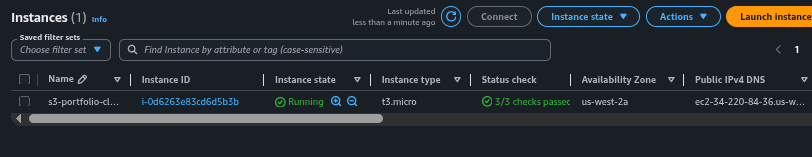
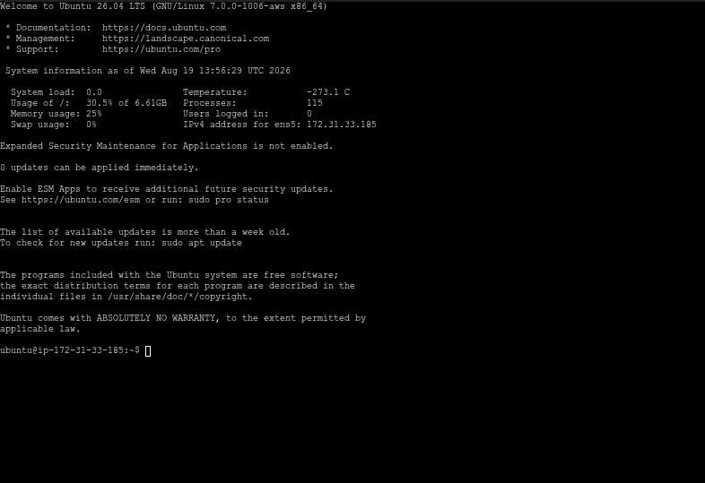
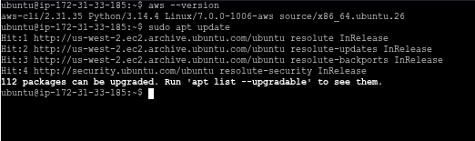
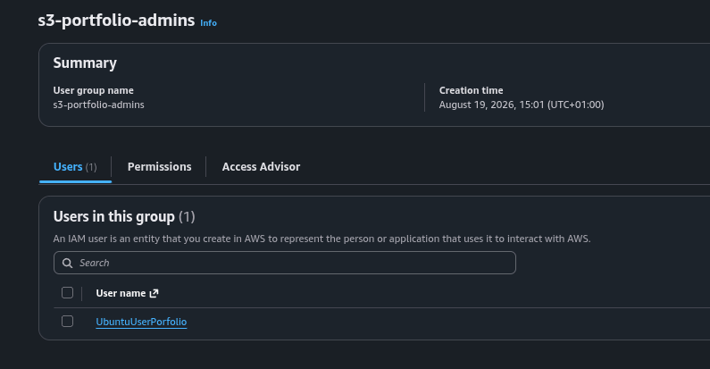
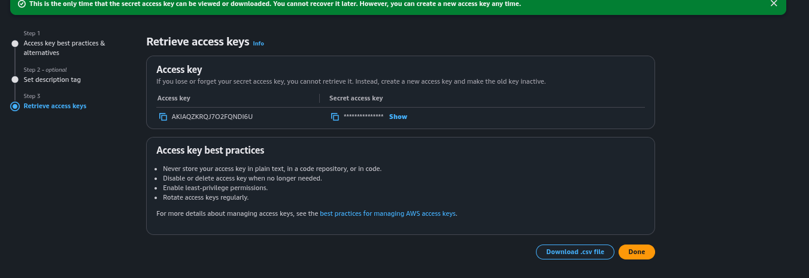
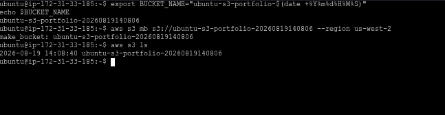
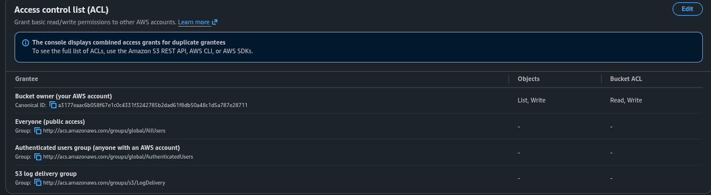
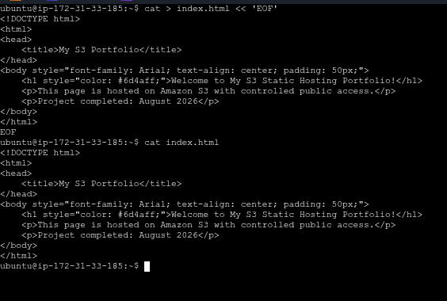
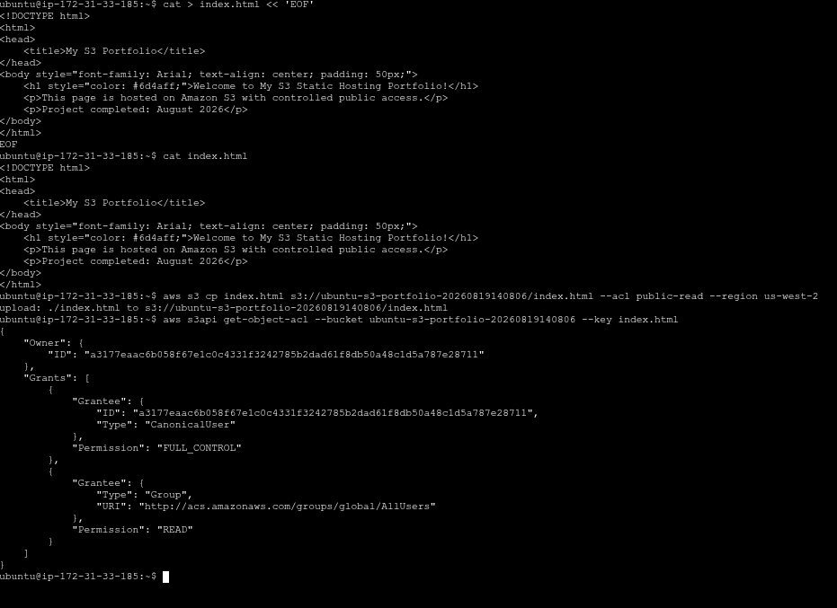
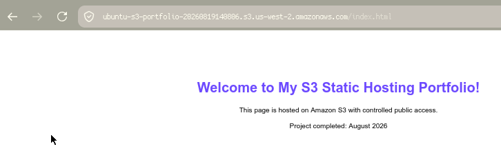

# S3 Static Content Hosting Portfolio Project

## Overview
AWS S3 bucket provisioning with controlled public object access.

### Technologies Used
- AWS CLI v2
- Amazon S3
- EC2 Instance (Ubuntu 26.04 LTS)

### Skills Demonstrated
- S3 bucket provisioning via CLI
- Object-level public ACLs (not bucket-wide)
- Public access block configuration
- Multi-interface verification (Console + CLI)

## Architecture
This project creates a publicly accessible S3 bucket where only specific objects (not the entire bucket) are exposed.

## Prerequisites
- AWS Account with IAM credentials
- EC2 Instance (Linux)
- AWS CLI v2 installed

### 1. EC2 Instance Running

### 2. SSH Connection Established

### 3. AWS CLI Version Check

### 4. IAM User Created

### 5. Access Keys Retrieved

### 6. S3 Bucket Permissions — Block Public Access OFF

### 7. S3 Object Ownership — Bucket Owner Preferred

### 8. HTML File Creation

### 9. Bucket Listing & ACL Verification

### 10. Browser Showing Live S3 Page

